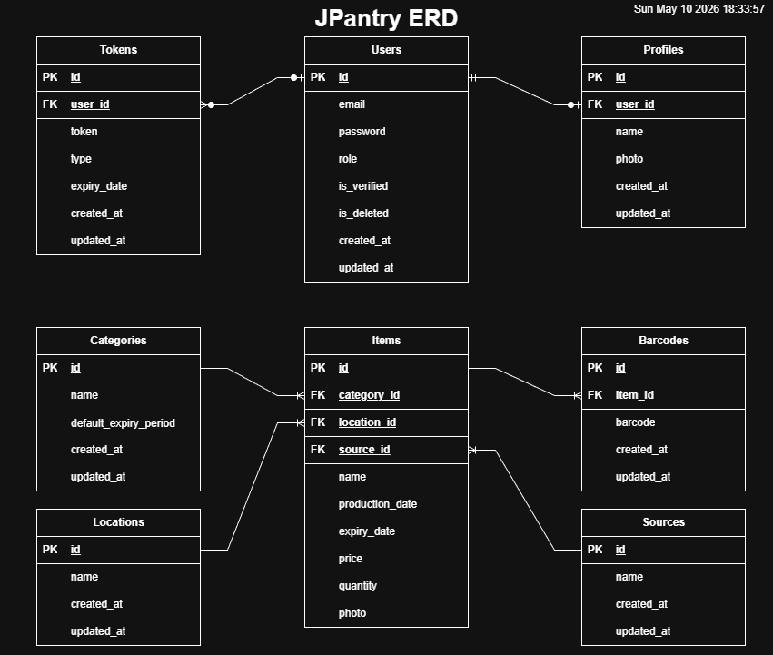

# 🥫 JPantry

## Table of Contents
<!-- TOC -->
* [🥫 JPantry](#-jpantry)
  * [Table of Contents](#table-of-contents)
  * [Description](#description)
  * [🖇 Entity Relationship Diagram](#-entity-relationship-diagram)
  * [API Endpoints](#api-endpoints)
    * [User Profiles](#user-profiles)
    * [Users](#users)
    * [Category](#category)
    * [Source](#source)
    * [Location](#location)
    * [Barcode](#barcode)
    * [Item](#item)
    * [🔐 Authentication](#-authentication)
    * [📝 Notes](#-notes)
  * [🛠 Tools & Technologies](#-tools--technologies)
    * [Language & Build](#language--build)
    * [Framework](#framework)
    * [Persistence](#persistence)
    * [Authentication](#authentication)
    * [Logging & Utilities](#logging--utilities)
    * [Third-Party Libraries](#third-party-libraries)
    * [Testing](#testing)
    * [Software & Other Tools](#software--other-tools)
  * [📃 Project Report](#-project-report)
    * [📆 Project Management Board](#-project-management-board)
    * [👥 User Stories](#-user-stories)
      * [Personas](#personas)
      * [👑 Owner User Stories](#-owner-user-stories)
      * [👨‍👩‍👦‍👦 Member User Stories](#-member-user-stories)
      * [👤 Guest User Stories](#-guest-user-stories)
    * [👩🏽‍💻 General Approach to Development](#-general-approach-to-development)
    * [💀 Major Hurdles & Challenges](#-major-hurdles--challenges)
    * [📄 References](#-references)
  * [📝 Installation & Testing Instructions (Using Docker)](#-installation--testing-instructions-using-docker)
<!-- TOC -->

---

## Description

Pantry list & management API built with JAVA Spring Boot. This API was designed for individuals and households to use,
although it could be useful for small cold stores as well.

**Main Features:**
- Record your food items in storage and keep track of availability, and what needs restocking.
- Find product info online by barcode lookup, and autopopulate item's data instead of typing it all in.
- Unlimited categories, sources, locations, items and other data with no restriction. Customize your database as you see fit.
- Have read-access-only verified member accounts to allow your household to view the data without messing it up. 
- User verification through tokens, auto sent to new users via e-mail service.

---

## 🖇 Entity Relationship Diagram

---

## API Endpoints

### User Profiles

| Method | Endpoint         | Description                          |
|--------|------------------|--------------------------------------|
| GET    | `/profile`       | Get the authenticated user's profile |
| POST   | `/profile`       | Create a user profile                |
| PATCH  | `/profile`       | Update the user's profile            |
| GET    | `/profile/photo` | Download the user's profile photo    |
| POST   | `/profile/photo` | Upload the user's profile photo      |
| DELETE | `/profile/photo` | Delete the user's profile photo      |

### Users

| Method | Endpoint                           | Description                                                        |
|--------|------------------------------------|--------------------------------------------------------------------|
| POST   | `/auth/users/register`             | Register a new user                                                |
| POST   | `/auth/users/register/default`     | Register the default admin user. First account in the system only. |
| POST   | `/auth/users/register/admin`       | Register an admin user                                             |
| POST   | `/auth/users/login`                | Log in a user                                                      |
| POST   | `/auth/users/verify?token={token}` | Verify email from URL                                              |
| POST   | `/auth/users/token?token={token}`  | Reissue a verification token                                       |
| POST   | `/auth/users/change-password`      | Change the user's password                                         |
| POST   | `/auth/users/forgot-password`      | Request a password reset                                           |
| POST   | `/auth/users/reset?token={token}`  | Reset a password using a token                                     |
| DELETE | `/auth/users/{id}`                 | Soft-delete a user                                                 |

### Category

| Method | Endpoint                   | Description               |
|--------|----------------------------|---------------------------|
| POST   | `/category/add`            | Add a new category        |
| PATCH  | `/category/edit`           | Edit an existing category |
| GET    | `/category/list`           | Get all categories        |
| GET    | `/category?id={id}`        | Get a category by ID      |
| GET    | `/category?name={name}`    | Get a category by name    |
| DELETE | `/category/delete?id={id}` | Delete a category         |

### Source

| Method | Endpoint                 | Description             |
|--------|--------------------------|-------------------------|
| POST   | `/source/add`            | Add a new source        |
| PATCH  | `/source/edit`           | Edit an existing source |
| GET    | `/source/list`           | Get all sources         |
| GET    | `/source?id={id}`        | Get a source by ID      |
| GET    | `/source?name={name}`    | Get a source by name    |
| DELETE | `/source/delete?id={id}` | Delete a source         |

### Location

| Method | Endpoint                   | Description               |
|--------|----------------------------|---------------------------|
| POST   | `/location/add`            | Add a new location        |
| PATCH  | `/location/edit`           | Edit an existing location |
| GET    | `/location/list`           | Get all locations         |
| GET    | `/location?id={id}`        | Get a location by ID      |
| GET    | `/location?name={name}`    | Get a location by name    |
| DELETE | `/location/delete?id={id}` | Delete a location         |

### Barcode

| Method | Endpoint                              | Description                                                  |
|--------|---------------------------------------|--------------------------------------------------------------|
| GET    | `/barcode/list`                       | Get all barcodes                                             |
| GET    | `/barcode?id={id}`                    | Get a barcode by ID                                          |
| GET    | `/barcode?barcode={barcode}`          | Get a barcode by barcode number                              |
| GET    | `/barcode/scan`                       | Scan a barcode image and get the barcode number              |
| POST   | `/barcode/generate?barcode={barcode}` | Generate a barcode image from barcode number                 |
| GET    | `/barcode/search?barcode={barcode}`   | Search a barcode through Open Food Facts and get online data |
| DELETE | `/barcode/delete?id={id}`             | Delete a barcode                                             |

### Item

| Method | Endpoint                              | Description                                                |
|--------|---------------------------------------|------------------------------------------------------------|
| POST   | `/item/add`                           | Add a new item                                             |
| POST   | `/item/map?barcode={barcode}`         | Create a new item by mapping its data from Open Food Facts |
| PATCH  | `/item/edit`                          | Edit an existing item                                      |
| GET    | `/item?id={id}`                       | Get an item by ID                                          |
| GET    | `/item/photo?id={id}`                 | Get an item's photo                                        |
| GET    | `/item/list`                          | Get all items                                              |
| GET    | `/item/list/by?name={name}`           | Get items by name                                          |
| GET    | `/item/list/by?category={categoryId}` | Get items by category                                      |
| GET    | `/item/list/by?barcode={barcode}`     | Get items by barcode                                       |
| GET    | `/item/list/by?location={locationId}` | Get items by location                                      |
| GET    | `/item/list/by?source={sourceId}`     | Get items by source                                        |
| GET    | `/item/list/less?q={qty}`             | Get items with quantity less than `q`                      |
| GET    | `/item/list/greater?q={qty}`          | Get items with quantity greater than `q`                   |
| DELETE | `/item/delete?id={id}`                | Delete an item by ID                                       |

### 🔐 Authentication
- **Security Scheme**: Bearer Token (`Authorization: Bearer <token>`)

### 📝 Notes
- All endpoints require **Bearer token authentication** unless otherwise specified.
- Use `application/json` for request bodies.
- Responses are not detailed in this spec — adapt based on your implementation.

---

## 🛠 Tools & Technologies

### Language & Build
| Tool                                 | Version | Purpose                                  |
|--------------------------------------|---------|------------------------------------------|
| [Java](https://www.oracle.com/java/) | 17      | Primary programming language             |
| [Maven](https://maven.apache.org/)   | —       | Build automation & dependency management |

### Framework
| Tool                                                                       | Version | Purpose                                         |
|----------------------------------------------------------------------------|---------|-------------------------------------------------|
| [Spring Boot](https://spring.io/projects/spring-boot)                      | 4.0.6   | Application framework (parent starter)          |
| [Spring Boot Starter Web MVC](https://docs.spring.io/spring-boot/)         | 4.0.6   | RESTful web layer (controllers, routing)        |
| [Spring Boot Starter Data JPA](https://spring.io/projects/spring-data-jpa) | 4.0.6   | ORM & repository abstraction over JPA/Hibernate |
| [Spring Boot Starter Security](https://spring.io/projects/spring-security) | 4.0.6   | Authentication & authorization                  |
| [Spring Boot Starter Mail](https://docs.spring.io/spring-boot/)            | 4.0.6   | Email sending (verification, password reset)    |
| [Spring Boot DevTools](https://docs.spring.io/spring-boot/)                | 4.0.6   | Hot reload & developer productivity             |

### Persistence
| Tool                                              | Version | Purpose                             |
|---------------------------------------------------|---------|-------------------------------------|
| [PostgreSQL Driver](https://jdbc.postgresql.org/) | —       | JDBC driver for PostgreSQL database |

### Authentication
| Tool                                         | Version | Purpose                         |
|----------------------------------------------|---------|---------------------------------|
| [JJWT API](https://github.com/jwtk/jjwt)     | 0.11.5  | JSON Web Token API              |
| [JJWT Impl](https://github.com/jwtk/jjwt)    | 0.11.5  | Runtime implementation of JJWT  |
| [JJWT Jackson](https://github.com/jwtk/jjwt) | 0.11.5  | JSON (de)serialization for JWTs |

### Logging & Utilities
| Tool                                         | Version | Purpose                                            |
|----------------------------------------------|---------|----------------------------------------------------|
| [Logback Classic](https://logback.qos.ch/)   | —       | Logging implementation                             |
| [Project Lombok](https://projectlombok.org/) | —       | Boilerplate reduction (getters, setters, builders) |

### Third-Party Libraries
| Tool                                                                                | Version | Purpose                                     |
|-------------------------------------------------------------------------------------|---------|---------------------------------------------|
| [Spire.Barcode for Java](https://www.e-iceblue.com/Introduce/barcode-for-java.html) | 5.1.11  | Barcode scanning & image generation         |
| [Open Food Facts Java Wrapper](https://github.com/openfoodfacts/openfoodfacts-java) | 0.9.3   | Fetch product data from Open Food Facts API |

### Testing
| Tool                                                                     | Version | Purpose                                                                                      |
|--------------------------------------------------------------------------|---------|----------------------------------------------------------------------------------------------|
| [Spring Boot Starter Web MVC Test](https://docs.spring.io/spring-boot/)  | 4.0.6   | Web layer testing (MockMvc, etc.)                                                            |
| [Spring Boot Starter Data JPA Test](https://docs.spring.io/spring-boot/) | 4.0.6   | Repository/persistence layer testing                                                         |
| [Spring Boot Starter Security Test](https://docs.spring.io/spring-boot/) | 4.0.6   | Security testing utilities                                                                   |
| [Spring Boot Starter Mail Test](https://docs.spring.io/spring-boot/)     | 4.0.6   | Mail sending testing                                                                         |
| [Postman](https://www.postman.com/)                                      | —       | API testing & documentation (see [JPantry](docs/JPantry.postman_collection.json) collection) |

### Software & Other Tools
| Tool                                                                      | Version   | Purpose                                                               |
|---------------------------------------------------------------------------|-----------|-----------------------------------------------------------------------|
| [Spring Initializr](https://start.spring.io/)                             | 4.0.6     | Creating base Spring Boot application                                 |
| [IntelliJ IDEA](https://www.jetbrains.com/idea/download/?section=windows) | 2025.3.11 | Development IDE                                                       |
| [Git](https://git-scm.com/)                                               | 2.54.0    | Code repository backup and management                                 |
| [Github.com](https://github.com/falansari/JPantry)                        | —         | Git project management and online repository                          |
| [Github Desktop](https://github.com/apps/desktop)                         | 3.5.8     | Git repository management GUI client                                  |
| [Kleopatra](https://www.openpgp.org/software/kleopatra/)                  | 5.0.2     | Git signing certificate manager for GnuPG for auto signed git commits |
| [Draw.io Desktop Edition](https://www.drawio.com/)                        | 29.7.8    | Flowchart & diagram maker tool for ERD                                |
| [Docker Desktop](https://www.docker.com/products/docker-desktop/)         | 4.70.0    | Containerization of the app's build                                   |
| [Jenkins](https://www.jenkins.io/)                                        | 2.555.1   | Automated app building and deployment                                 |
| [Codecks.io](https://www.codecks.io/)                                     | —         | Project task management and time tracking                             |

---

## 📃 Project Report

### 📆 Project Management Board
[GitHub Project](https://github.com/users/falansari/projects/15/views/1)

### 👥 User Stories

#### Personas
- **Guest** — an unauthenticated visitor.
- **Member** — a registered, authenticated household user with read-only access to pantry data.
- **Owner** — a privileged user who manages all data (users, items, categories, sources, locations, barcodes) and is the only role allowed to create, update, or delete records.

#### 👑 Owner User Stories
- As an **owner**, I want to **register other owner accounts**, so that I can delegate administrative responsibilities.
- As an **owner**, I want to **bootstrap a default owner account on first launch**, so that the system always has an initial privileged user.
- As an **owner**, I want to **soft delete user accounts by ID**, so that I can manage system integrity without permanently losing data.
- As an **owner**, I want to **add, edit, and delete pantry items (manually with category, location, source, quantity, and barcode)**, so that I can keep an accurate household inventory.
- As an **owner**, I want to **add pantry items by mapping them from Open Food Facts via barcode**, so that I can save time on data entry.
- As an **owner**, I want to **adjust item quantities (e.g., after using or restocking)**, so that the inventory always reflects reality.
- As an **owner**, I want to **add, edit, and delete shared categories**, so that items have a consistent classification system.
- As an **owner**, I want to **add, edit, and delete shared sources**, so that items can be accurately tagged with where they came from.
- As an **owner**, I want to **add, edit, and delete storage locations**, so that I can organize where items are kept (e.g., fridge, pantry shelf).
- As an **owner**, I want to **delete stored barcodes**, so that I can maintain a clean barcode catalog.
- As an **owner**, I want to **generate a barcode image from a number**, so that I can print or share it.
- As an **owner**, I want to **upload, update, and delete my profile photo**, so that I can personalize my account.
- As an **owner**, I want to **create and update my user profile**, so that my account reflects my identity.
- As an **owner**, I want to **change my password while logged in**, so that I can keep my account secure.
- As an **owner**, I want to **log in securely with authentication**, so that only authorized personnel can access sensitive functionality.
- As an **owner**, I want to **have full access to all system features**, so that I can oversee and maintain the entire application.

#### 👨‍👩‍👦‍👦 Member User Stories
- As a **member**, I want to **view a single item by ID, including its photo**, so that I can inspect its details.
- As a **member**, I want to **list all pantry items**, so that I can see everything in the household pantry at a glance.
- As a **member**, I want to **filter items by name, category, barcode, location, or source**, so that I can quickly find what I'm looking for.
- As a **member**, I want to **see items with quantity below a threshold**, so that I know what needs to be restocked.
- As a **member**, I want to **see items with quantity above a threshold**, so that I avoid over-buying.
- As a **member**, I want to **browse and look up categories by id or name**, so that I can understand how items are classified.
- As a **member**, I want to **browse and look up sources by id or name**, so that I can see where items came from.
- As a **member**, I want to **browse and look up locations by id or name**, so that I can find where items are stored.
- As a **member**, I want to **scan a barcode image to decode its value**, so that I can identify a product from a photo.
- As a **member**, I want to **search a barcode online via Open Food Facts**, so that I can fetch product details that aren't stored locally.
- As a **member**, I want to **list and look up stored barcodes (by id or number)**, so that I can reference the barcode catalog.
- As a **member**, I want to **view my own user profile and download my profile photo**, so that I can review my account information.
- As a **member**, I want to **change my password while logged in**, so that I can keep my account secure.
- As a **member**, I want to **log in securely with authentication**, so that I can access pantry data safely.

#### 👤 Guest User Stories
- As a **guest**, I want to **register a new account**, so that I can start accessing pantry data.
- As a **guest**, I want to **verify my email address via the link sent to me**, so that I can activate my account.
- As a **guest**, I want to **request a new verification token if my original one expired**, so that I can complete signup.
- As a **guest**, I want to **request a password reset email if I forget my password**, so that I can regain access to my account.
- As a **guest**, I want to **reset my password using the emailed link**, so that I can choose a new one without logging in.
- As a **guest**, I want to **perform these account-recovery actions without being logged in**, so that the process is simple and accessible.

### 👩🏽‍💻 General Approach to Development
My approach to developing any app always follows a set sequence of steps I take mostly in order:
1. **Brainstorm** what the app is, what it will do, how it will do it. Rough sketching the ERD and list of functionality. Takes 1-2hrs.
2. **Finalize ERD** design by cleaning up the rough sketch. This step requires some research into the feasibility of the project, and making adjustments based on that. Takes 1-2hrs.
3. **Plan the development** by creating detailed issues, milestones and project board. This makes it clear exactly what needs to get delivered and when. Takes 1-2hrs with ongoing updates as needed.
4. **Develop the app** step by step, focusing on one system at a time, one component of that system at a time. Any app that needs user system I start with that first, and move on to the app's actual functionality after.
5. **Test the app** while developing it, I do not merge a feature nor move on from it until I have fully tested it, verified how it works, optimized it and finalized the code for it. This way nothing is submitted without meeting base quality requirements.
6. **Write the documentation** after finishing all basic requirements and are ready to release v1.0.0 of the app.

This app is built to use Asynchronous multithreaded functions for any mass-operation endpoint, such as list endpoints.

### 💀 Major Hurdles & Challenges

My biggest challenge this project was finding third party APIs that can be used for barcode reading/generating and food items
data gathering that are available for free and public use. Most open source barcode readers were outdated and not currently maintained,
while most food product databases were behind pay walls.
I found E-Iceblue's Spire.Barcode software, which has a limited free community edition that serves this app's needs,
and Open Food Facts' API service, which limits requests to 15/min/user which is also suitable for this app's needs.

However, the open food facts' API java wrapper seems to be a bit outdated, as it was pulling in old incompatible java dependencies
causing errors and issues with project. I fixed it by excluding its Logback dependency and letting the framework manage that
through POM changes.

### 📄 References
- [codingnomads.com](https://codingnomads.com/spring-data-jpa-repository-common-issues) for fixing model relationship issues.
- [E-Iceblue's Spire.Barcode documentation](https://www.e-iceblue.com/Tutorials/Java/Spire.Barcode-for-Java/Getting-Started/read-barcode-in-java.html) for setting up and using Spire.Barcode.
- [Open Food Facts API documentation](https://openfoodfacts.github.io/openfoodfacts-server/api/) for setting up and using Open Food Facts API.

---

## 📝 Installation & Testing Instructions (Using Docker)
1. [Clone the repository](https://github.com/falansari/JPantry.git).
2. Copy [application-dockerexample.properties](src/main/resources/application-dockerexample.properties) file, and name the copy application-docker.properties, and update the details inside for your connection info.
3. Make sure you have Docker Desktop setup and working on your system. This app was created and setup with Docker Desktop on Windows 10. You will need Windows' Linux Subsystem to run it.
4. In bash terminal (can use Git Bash, or IntelliJ's built-in terminal), run the commands `docker-compose build` then `docker-compose up`. Leave the terminal window open if you want to see live logs through it. You can alternatively see them through docker's app.
5. For Endpoint Testing: import POSTMAN endpoints collection from [JPantry.postman_collection.json](docs/JPantry.postman_collection.json) file in docs folder,
   and update the collection's **base_url variable** to `http://localhost:5001/` (change :#### to match your chosen port number in properties) and **users_base_url** to `auth/users/`
6. Create the default admin account using `/auth/users/register/default` REST endpoint. Use your own e-mail address to get verification token.
7. Verify the admin account by pasting and running the URL link in the Verify Email from URL endpoint in Users folder (Postman).
8. Login to your newly verified account through Login User endpoint in Users folder.
9. Copy the response JWT token and paste it in JPantry → Authorization → Auth Type (Bearer Token) → Token field. This token will remain active for 24hrs (after which you'll need to login again). Now you can test use all the Postman endpoints.